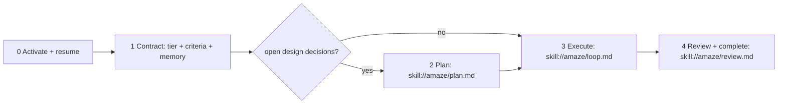

# AMAZE

**MANDATORY**: the first user-visible line this turn is exactly `AMAZE MODE ENABLED!`.

Deliver exactly what was asked, working end to end, proven by captured evidence. A green test suite means a unit-level contract holds — it never proves the user-facing behavior works. You are done only when every success criterion PASSES with its evidence captured.

## Phase map

This skill owns Phases 0-1 and the routing. Each later phase lives in a chained skill you load on demand with the `read` tool:

- **Phase 2 — Plan** → `read skill://amaze/plan.md` (only when open design decisions remain).
- **Phase 3 — Execute** → `read skill://amaze/loop.md`.
- **Phase 4 — Review & complete** → `read skill://amaze/review.md`.

Load each sub-skill when its phase begins and follow it literally. The contract below (tier, criteria, memory, ownership) binds every phase.

## Non-negotiables

- **No new subagents.** omp's `scout`/`plan`/`review`/`reviewer`/`librarian`/`designer`/`sonic`/`task` are the roster. Orchestrate them with the `task` tool; never define a new agent.
- **No omp core or config changes.** This workflow runs entirely on this skill set plus existing tools.
- **Plane mutation is parent-orchestrator only.** Subagents report findings; the parent records them to Plane. Never let a subagent call `plane_task_*`.
- **Failing-first evidence is the contract.** Every criterion is captured RED before the fix and GREEN after. Evidence added after the green code does not count.

## Phase 0 — Activate and resume

1. Print `AMAZE MODE ENABLED!` once.
2. Restate the request in one sentence.
3. Call `plane_task_lookup` to see whether this repo already tracks the task; if it does, call `amaze_status(task_key)` to recover the contract before planning anything new.

## Phase 1 — The contract

### Tier triage (classify once, ratchet up only)

Judge by what THIS session will itself edit or execute; delegated work is payload and does not raise your tier.

- **LIGHT** (default): a known pattern with no open design decisions — one-spot bugfix, an endpoint following an existing pattern, a validation rule, a query tweak, copy/constants, or launching/steering another session.
- **HEAVY** (any one fact forces it): a new module/layer/domain model/abstraction; auth, security, session, or permission code; building or changing an external integration (API/queue/payment/webhook); a DB schema or migration; concurrency, transaction boundaries, or cache invalidation; a refactor crossing domain boundaries; or the user asked for care ("carefully", "thoroughly", "design first") or a review of this session's work.

When unsure, take HEAVY. If a HEAVY fact surfaces mid-task, upgrade immediately and redo whatever LIGHT skipped. Never downgrade. Record the tier and a one-line justification in the notepad.

### Register the binding goal

1. `amaze_contract_set(task_key, objective, tier, criteria, repo?)` — one call: creates/updates the local contract file `.omp/amaze/<task_key>.json`, finds-or-creates the Plane work item, and posts the contract as a start comment. No separate `plane_task_start`.
2. `todo init` — the live checklist; exactly one item `in_progress` at a time.
3. Each criterion is `{id?, scenario, observable, proof?}`: an **exact scenario** (the literal command / page action / payload), the binary PASS/FAIL `observable`, and `proof` (`red-green` default, or `review` when there's no test seam). LIGHT: 1-2 criteria (happy path + the riskiest edge). HEAVY: 3+ (happy; edges — boundary/empty/malformed/concurrent; and an adjacent-surface regression named by file + function).

### task_key convention

- Default: a short kebab slug of the objective — `amaze-jwt-refresh`, `fix-login-race`.
- On a feature branch you may prefix it — `<branch>::<slug>`.
- Keep it stable and human-readable so `plane_task_lookup` finds it. Resuming the same work uses the same key and continues the same work item.

## Memory

The contract file `.omp/amaze/<task_key>.json` is the source of truth for criteria, evidence, and progress — `amaze_evidence` writes it, `amaze_status(task_key)` reads it back in one call. Don't duplicate that state in prose.

The local notepad `local://amaze-<task_key>.md` holds free-form working memory only: `Plan` / `Findings` / `Learnings` / `Now` / `Todo`. Append-only.

Plane stays the durable, human-visible layer (`plane_task_*`); a compaction hook auto-preserves a contract summary, so after any context loss call `amaze_status(task_key)` (and re-read notepad `## Findings` if needed) before resuming from `## Now`.

## Routing

- Open design decisions remain (unclear module boundaries, several viable decompositions, non-obvious dependency order) → `read skill://amaze/plan.md`. Otherwise skip to execution.
- Ready to build → `read skill://amaze/loop.md`.
- All criteria pass → `read skill://amaze/review.md` before declaring done.

Each sub-skill ends by pointing to the next phase. Do not declare completion outside the review phase (`amaze/review.md`).
